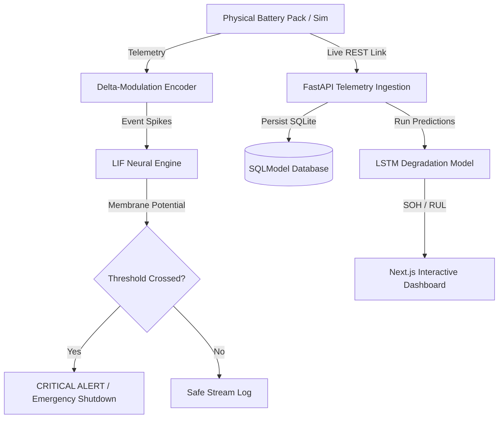

# NeuroCharge

NeuroCharge is a brain-inspired, deep-tech neuromorphic battery management and EV analytics platform. It implements stateful **Spiking Neural Network (SNN)** processing on battery cell telemetry to detect thermal runaway anomalies in under a second, while synchronizing physical parameters against a real-time **Digital Twin** ideal model and projecting capacity degradation using LSTM intelligence.

---

## Key Features

### 1. Stateful Spiking Neural Network (SNN) Anomaly Detector
- **Leaky Integrate-and-Fire (LIF) Model**: Simulates biological neural membrane potential ($V_m$) locally and on the backend server.
- **Delta-Modulation Event Encoding**: Converts continuous telemetry signals (voltage, current, temperature) into discrete UP ($+1$) and DOWN ($-1$) spikes only when values drift past dynamic thresholds.
- **Immediate Anomaly Firing**: If a flurry of warning spikes accumulates within a short temporal window, the membrane potential crosses $1.0\text{V}$, instantly triggering emergency alerts to prevent thermal runaway.

### 2. Live Digital Twin & Calibration
- Tracks cell telemetry against an ideal thermal and electrochemical model.
- Calculates and visualizes **Model Drift Deltas** (Thermal Delta, Voltage Delta) in real-time to alert operators to early signs of chemical degradation or packing anomalies.

### 3. Predictive Health Projections (SOH & RUL)
- Projects **State of Health (SOH)** capacity retention curves dynamically.
- Computes **Remaining Useful Life (RUL)** in remaining charge cycles.
- Compares normal degradation against fast-charge accelerated aging curves.

### 4. Fully Animated Minimalist Dashboard
- **Hardware-Accelerated Staggers**: CSS Keyframe slide-ins for metrics cards to ensure smooth entry.
- **`requestAnimationFrame` Counter Transitions**: Numeric counters count up fluidly from 0 to targets over 1200ms with a premium cubic-out easing curve.
- **SVG ClipPath Mask Drawing**: Graph curves draw from left to right smoothly, bypassing path layout restrictions.

---

## Tech Stack

| Component | Technologies |
| :--- | :--- |
| **Frontend** | Next.js 16.2 (App Router), React 19, Tailwind CSS v4, TypeScript, requestAnimationFrame / CSS Animations |
| **Backend** | FastAPI, SQLModel (ORM), Uvicorn, SQLite database |
| **Testing** | Pytest, HTTPX, Python unittest |

---

## Architecture Overview



---

## How to Run Locally

### Prerequisites
- Python 3.10+
- Node.js 18+

---

### 1. Backend Server Setup

Navigate to the `backend` directory, create a virtual environment, install dependencies, and start the development server:

```bash
cd backend
python -m venv venv
# Windows:
.\venv\Scripts\activate
# macOS/Linux:
source venv/bin/activate

pip install -r requirements.txt
python -m uvicorn app.main:app --host 127.0.0.1 --port 8000
```

- **Default Administrator Credentials (Seeded):**
  - **Username:** `admin@neurocharge.com`
  - **Password:** `adminpassword123`

---

### 2. Frontend Dashboard Setup

Navigate to the `frontend` directory, install packages, and boot up the Next.js dev server:

```bash
cd ../frontend
npm install
npm run dev
```

- Open [http://localhost:3000](http://localhost:3000) in your browser.
- Click **Enter Dashboard** to view the real-time simulation panel.
- Enable the **Live API Link** checkbox in the sidebar to sync telemetry and SNN states directly with the SQLite database.

---

## Secured API Endpoints

All endpoints under `/api/v1/battery` require a secure Bearer token retrieved from `/api/v1/auth/login`.

| Endpoint | Method | Description |
| :--- | :--- | :--- |
| `/api/v1/auth/login` | `POST` | Authenticates user credentials and returns JWT access token. |
| `/api/v1/telemetry` | `POST` | Ingests live cell telemetry frames and processes event encoding. |
| `/api/v1/battery/{id}/status` | `GET` | Retrieves active membrane potential and current telemetry frame. |
| `/api/v1/battery/{id}/health` | `GET` | Classifies cell status based on State of Health (SOH) boundaries. |
| `/api/v1/battery/{id}/predictions`| `GET` | Fetches SOH projections and projected capacity decay curves. |
| `/api/v1/battery/{id}/recommendations`| `GET` | Analyzes historic telemetry trends and issues preservation advices. |

---

## SNN Model Parameters

The Leaky Integrate-and-Fire (LIF) network evaluates signals using the following constant configuration:

*   **Resting Potential ($V_{rest}$):** $0.0\text{V}$
*   **Firing Threshold ($V_{thresh}$):** $1.0\text{V}$
*   **Leak Constant ($\tau$):** $4.0\text{ steps}$
*   **Temperature Spike Weight ($w_T$):** $+0.55\text{V}$ per thermal anomaly event.
*   **Current Spike Weight ($w_I$):** $+0.25\text{V}$ per current spike event.
